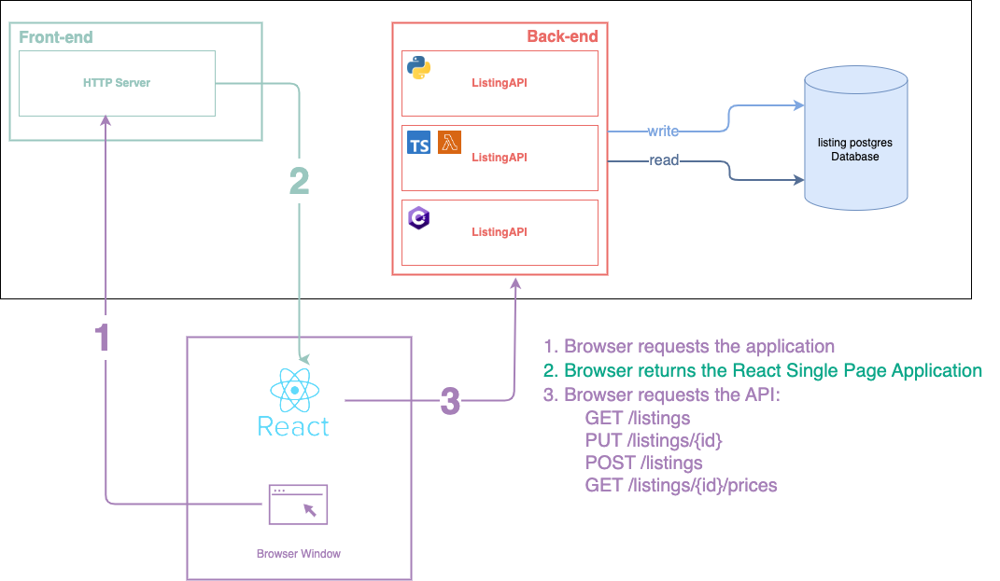

Welcome to the AVIV technical test! This README will provide you with everything you need to know to start the exercise.
**Please read it thoroughly before you start working on your implementation proposal.**

## Before you start

**Pick the right test.** You are expected to achieve *one* technical test to assert your technical skills depending on the interview process you are currently in. If you are unsure of which test you should achieve, please reach out to the recruiter you are in contact with.

**Spend a reasonable amount of time.** There is no hard limit on how much time you should spend on the exercise. In practice, we do not expect candidates
to spend more than three hours on it. In the pull request you will create, a few questions will be asked, including the amount of time you spent on it.

**Running the test.** We recommend you to use GitHub Codespaces to run this test. It is preconfigured, so you can start to code now, without additional configuration, enabling you
to show most of your skills. You can still clone the repository and work locally if you prefer, or work in a hybrid environment using
a local IDE while having your code running remotely. It comes with a few drawbacks documented in the [Known issues](#known-issues) section below depending on the IDE you use.

## Getting started

Please follow carefully these instructions to get started. This is the recommended path to run the technical test and should save you from setup headache.
You can always choose a different approach you are more used to (e.g., cloning and running locally the test), at the risk of spending more time on the test.

### I - Creating your Codespace

GitHub provides a feature called GitHub Codespaces to allow working using VS Code directly in development containers running in the Cloud. This is the recommended approach for
completing this test. It will use some of your free monthly quota. You can have a look at your remaining quota [in your account settings](https://github.com/settings/billing#usage).

1. Click on the green `‹› Code` button at the top of this page.
> ℹ️ Make sure to *not* use the big green `Create codespace` button.
2. Click on `⋯` at the top right of the modal.
3. Click on `+ New with options...`.
4. In the `Dev container configuration`, choose the one that matches the technical test you're expected to perform.
> ℹ️ Do not change the branch nor the region nor the Machine type (except if you know what you are doing and the consequences).
5. Click on the `Create codespace` button.

Creating the Codespace will take a few minutes. Read the following steps while waiting.

> **⚠️ Heads up!**
> 
> Before starting using your Codespace, **please finish reading the following**.

### II - A few tips on using your Codespace

**Wait a bit longer.** When the Codespace is created, do not interact with the Codespace and wait a few dozen additional seconds. The Codespace is ready when the README is opened and displayed in the main screen of VS Code. If not, wait a little longer.

**Repository default state.** By default, the Codespace will be preconfigured, so you can immediately start your usual coding process, like you would do just after cloning a repository. You can use Git normally in your Codespace.

**Port forwarding when coding in the Cloud.** The Codespace port forwarding rules are preconfigured, so you do not have to perform
any additional configuration. If you are unsure on how to reach a service from your Codespace (e.g., a running API), you can go to the `PORTS` tab next to your open `TERMINAL`. You will see
all the declared services. Services that do not have a green 🟢 icon are not started yet. You will launch them by following the Codespace README that is open to you on first start. You can click on the local address to access the running service. By default, the visibility of services is `🔒 Private` (it means you need to
be authenticated with GitHub to load the page). If you want access from an external tool (for instance Postman), you can change the visibility to `Public`.

### III - Handing over your work

When you have completed the exercises, you are expected to **send a pull request link** to the recruiter. Make sure to read and answer all the questions in the
pull request template that will appear when creating the pull request. This pull request will be reviewed by multiple developers from AVIV. If you want to have
a proactive look at the questions you are expected to answer to manage your time properly, you can have a look to the [pull request template](./.github/pull_request_template.md).

### IV - Understanding the context

At AVIV, we often deal with _listings_. A listing is the description of a real estate that can be rented or bought. It
contains information such as price and availability. We also display real estates characteristics, such as its category
or size.

It has been decided by the product manager of your team to provide a view of the listings to our customers. Specifically, we want to display
a list of each listing we have in our database, with its price history. Your team has determined that a REST
API should be developed to provide the listings, so they can be displayed on a single page application. Your colleagues developers have
already started to provide a resource endpoint to retrieve, create and update such listings in an API called the
`ListingAPI`.

Your team made a schema of the current application architecture:

### V - Starting to code

You can now start reading the README in your Codespace. Enjoy coding!

## Known issues

This section contains a few details on known issues and workarounds.

### Working with JetBrains Gateway

JetBrains provides a beta software called Gateway, allowing to work with Codespaces while having your IDE running locally. It can starve your Codespace as it
requires a Java connector to run in the Codespace. In practice, we advise to either increase the CPU and RAM of your Codespace (at the risk of burning your free
credit faster) or go with VS Code for this test. We do not provide support for using JetBrains for this test (but teams are relying a lot on JetBrains awesome 
products at AVIV).
