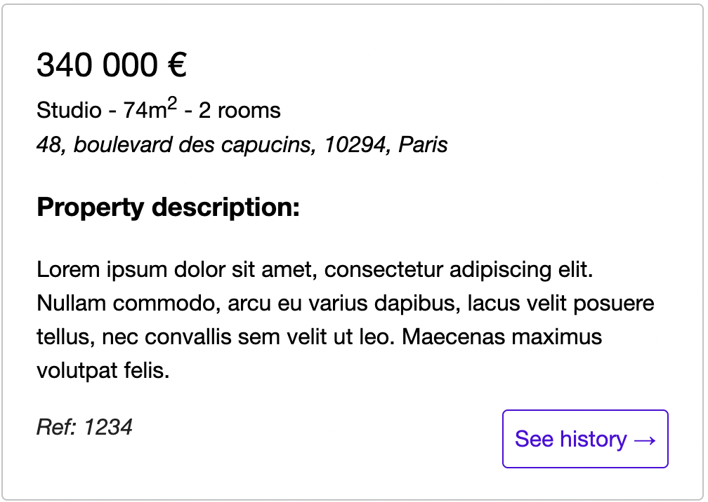

# AVIV Front-end Test

## Introduction

This repository contains instructions for the Aviv Frontend Technical Test.

Its aim is to give us an overview of your practical technical knowledge through a screening technical test.

## Completion time

There is no critical need to fulfill all the functional and technical requests, so keep in mind to focus on what you think you can solve within this timeframe rather trying to solve all the demands if this seems out of scope. Quality over quantity.
If you do not manage to provide all the requested features, please fulfill what are the features missing in the [SOLUTION.md](../SOLUTION.md) file explaining how you would have provided such feature.

## Objectives

The aim is to provide in a react application two different functional pages :

- A page that will provide a list of the available listings with a form to create new listings.
- A page that will provide the history for a specific listing.

A bootstrapped project is provided to you with react and some dependencies so you can start working directly without the headache of configuring the project.

### Install

Npm:

> npm i

### Run

Npm :

> npm start

### Launch test :

Npm:

> npm test

**Regarding CSS**

Note that the CSS styling is already provided and that we don't expect you to focus particularly on that part. The CSS is built on
[BEM](https://getbem.com/introduction/) principles and can be found in the file [`src/styles/global.scss`](./src/styles/global.scss).

## Logical and technical expectations

### New listing form

We want the main page to have a form that allows the user to create a new listing.
Below you will find a table of the required fields the user will have to fill in order to be able to submit the form and be accepted by the server :

| field key            | parent         | description                                                                                         | expected type  | nullable |
| -------------------- | -------------- | --------------------------------------------------------------------------------------------------- | -------------- | -------- |
| name                 |                | A user friendly name for the listing                                                                | string         | false    |
| postal_address       |                |                                                                                                     | object         | false    |
| street_address       | postal_address | The street address of the postal address.                                                           | string         | false    |
| postal_code          | postal_address | The postal code of the postal address.                                                              | string         | false    |
| city                 | postal_address | The city of the postal address.                                                                     | string         | false    |
| country              | postal_address | The country of the Postal Address, as a ISO 3166-1 alpha-2 country code.                            | 2 chars string | false    |
| description          |                | A user friendly description for the listing.                                                        | string         | false    |
| building_type        |                | The type of building the listing referers to. allowed values : `STUDIO`, `APARTMENT`, `HOUSE`       | string         | false    |
| latest_price_eur     |                | The price of the listing, in euros.                                                                 | number         | false    |
| surface_area_m2      |                | The surface of the listing, in square meters.                                                       | number         | false    |
| rooms_count          |                | The number of rooms of the listing.                                                                 | number         | false    |
| contact_phone_number |                | Listing main contact phone number, following the E.164 standard. Match patten : `^\+[1-9]\d{1,14}$` | string         | true     |

### Listings Page

We want the main page to provide a list of cards, each card representing a listing. The user should be able to click a card to go to a sub-page that will display the price history of the selected listing.

An [example](./src/containers/Listings/Listings.tsx) of a card is provided along the test for which you have a preview below :



### Listing history page

This sub-page should load and display a simple list of the history for a specific listing.
The sub-page should be accessible through the url `/:listingId/prices`.

## How to start the test

Simply clone the repository :

> git clone git@github.com:MeilleursAgents/aviv-technical-test.git

### Start the API

To start the API you will need to install Docker Desktop first , go to [Docker](https://www.docker.com/get-started).

The API is available at the following address `https://${CODESPACE_NAME}-8080.${GITHUB_CODESPACES_PORT_FORWARDING_DOMAIN}` by using the following command from the root folder of the repository :

    docker-compose -p aviv-technical-test run -p 8080:8080 --rm python-flask python app.py

## API Endpoints

The API will provide you with the data you need in order to produce the expected rendering.

- List of listings:

  > curl http://localhost:8080/listings

- History of a specific listing:

  > curl http://localhost:8080/listings/{id}/prices

- Post a new listing:
  > curl -X POST http://localhost:8080/listings -H 'Content-Type: application/json' -d '{ "name": "string", "postal_address": { "street_address": "48, boulevard des capucins", "postal_code": "10294", "city": "Paris", "country": "FR" }, "description": "string", "building_type": "STUDIO", "latest_price_eur": 380000, "surface_area_m2": 43, "rooms_count": 2, "bedrooms_count": 1, "contact_phone_number": "string" }'

Note that you can also access the endpoint documentation following [the context section](../README.md#context) of the main README.

## Data samples

### Listings

Below is an example of listing with history that will be provided by the API :

```json
[
  {
    "id": 1234,
    "created_date": "1970-01-01T00:00:00.000Z",
    "updated_date": "1970-01-01T00:00:00.000Z",
    "name": "Cozy studio in the center of Paris",
    "postal_address": {
      "street_address": "48, boulevard des capucins",
      "postal_code": "10294",
      "city": "Paris",
      "country": "FR"
    },
    "description": "string",
    "building_type": "STUDIO",
    "latest_price_eur": 380000,
    "surface_area_m2": 43,
    "rooms_count": 2,
    "bedrooms_count": 1,
    "contact_phone_number": "0123456789"
  }
]
```

### History

```json
[
  {
    "created_date": "1970-03-01T00:00:00.000Z",
    "price_eur": 340000
  },
  {
    "created_date": "1970-02-01T00:00:00.000Z",
    "price_eur": 320000
  },
  {
    "created_date": "1970-01-01T00:00:00.000Z",
    "price_eur": 300000
  }
]
```
